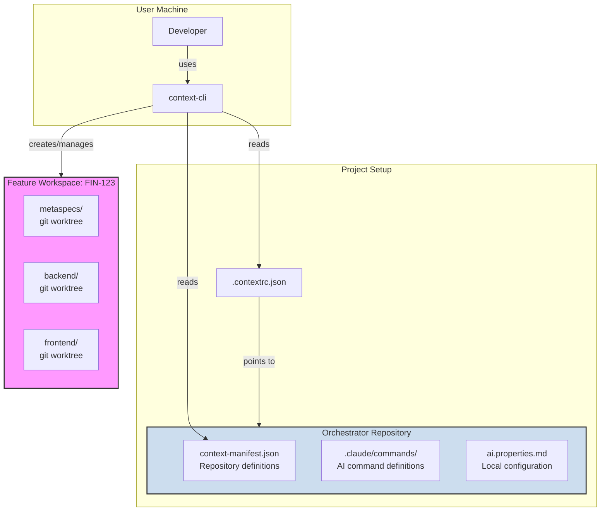

# Context-First CLI

A generic, cross-platform CLI to manage the **Context-First** development methodology across any project ecosystem. This tool provides a robust framework for orchestrating development workflows, managing multiple repositories, and ensuring consistency for both human developers and AI agents.

---

## 🚀 Core Concepts

This CLI is built on three core concepts that enable scalable, parallel, and context-aware development.

### 1. The Orchestrator Repository

Instead of embedding process logic into each of your application repositories, you define it in one central **Orchestrator Repository**. This repository acts as the single source of truth for your development methodology. It contains:

-   **Command Definitions**: Markdown files (`.claude/commands/`) that instruct an AI (like Claude) on the purpose and logic of each step in your process (e.g., `/work`, `/spec`, `/pr`).
-   **Repository Manifest**: A `context-manifest.json` file that maps out your entire project ecosystem, defining all repositories (including MetaSpecs) and their relationships.
-   **Configuration Templates**: Files like `ai.properties.md` that define project-specific commands (lint, test, build) and settings.

### 2. Feature Workspaces

To enable parallel development without conflicts, the CLI uses **Feature Workspaces**. When you start working on a new feature (e.g., an issue from Jira), the CLI creates a dedicated, isolated directory. Inside this workspace, it uses `git worktree` to check out a specific branch for each relevant repository. This is extremely efficient, as it doesn't re-clone the entire repository, saving disk space and time.

-   **Isolation**: Every feature has its own folder, preventing any overlap or context-clash between concurrent tasks.
-   **Efficiency**: Powered by `git worktree`, creating and switching between workspaces is nearly instantaneous.

### 3. The Agnostic CLI (`context-cli`)

This is the tool you install on your machine. It's completely project-agnostic. You can use the same CLI to manage any project.

-   **Cross-Platform**: Built with Node.js/TypeScript, it works seamlessly on Windows, macOS, and Linux.
-   **Configurable**: The `init` command creates a `.contextrc.json` file in your project, telling the CLI which Orchestrator to use.
-   **AI-Agnostic**: You can configure it to create command structures for different AI providers (e.g., `.claude/commands` for Claude, `.cursor/commands` for Cursor).

---

## 📦 Installation

Install the CLI globally on your machine via NPM.

```bash
npm install -g context-first-cli
```

---

## 📋 Commands Reference

### Setup Commands

| Command | Description |
| :--- | :--- |
| `context-cli init` | Initialize Context-First in an existing project by creating `.contextrc.json`. |
| `context-cli create:orchestrator` | Create a new orchestrator repository from a template with all necessary structure. |
| `context-cli add:repo` | Add a new code repository to `context-manifest.json` interactively. |
| `context-cli add:repo-metaspec` | Add or update the MetaSpecs repository in `context-manifest.json`. |
| `context-cli config:setup` | Interactively configure `ai.properties.md` for local development. |

### Workspace Commands

| Command | Description |
| :--- | :--- |
| `context-cli feature start <issue-id>` | Create a new feature workspace with isolated git worktrees. |
| `context-cli feature list` | List all active feature workspaces on your machine. |
| `context-cli feature switch <issue-id>` | Get the command to switch to an existing feature workspace. |
| `context-cli feature end <issue-id>` | Archive and clean up a completed feature workspace. |

### Diagnostic Commands

| Command | Description |
| :--- | :--- |
| `context-cli doctor` | Check environment and configuration for issues. |
| `context-cli status` | Show detailed status of the current workspace. |

---

## 🚀 Getting Started: The 5-Minute Workflow

The primary workflow is designed to be simple and centralized within the Orchestrator.

### Step 1: Create Your Orchestrator

This is your project's "home base". It defines your development process and the repositories involved.

```bash
# Run this once per project ecosystem
npx context-first-cli@latest create:orchestrator
```

This command interactively sets up your orchestrator, which includes:
-   `.contextrc.json`: A file that makes the orchestrator self-aware, so you can run all commands from here.
-   `context-manifest.json`: Defines all repositories in your project.
-   `.claude/commands/`: Pre-built command templates for your AI assistant.
-   `ai.properties.md`: A template for your local configuration (which is gitignored).

### Step 2: Configure Your Local Environment

Navigate into the new orchestrator directory and tell the CLI where your code is located.

```bash
cd your-orchestrator-name/
npx context-first-cli@latest config:setup
```

This will ask for your **`base_path`**, which is the absolute path to the folder where you keep all your git repositories (e.g., `~/workspace` or `~/dev`). It also asks if you want to enable `auto_clone`.

### Step 3: Add Your Repositories

Now, define the repositories that make up your project.

```bash
# Still inside the orchestrator directory
npx context-first-cli@latest add:repo
```

Run this command for each repository (e.g., `backend`, `frontend`, `admin`). It will interactively ask for the repository's ID, Git URL, and role, and save it to `context-manifest.json`.

### Step 4: Start a Feature

That's it for setup! Now you can start working on a feature. **From the orchestrator directory**, run:

```bash
npx context-first-cli@latest feature start <issue-id>
# Example: npx context-first-cli@latest feature start FIN-123
```

This command will:
1.  Read your `context-manifest.json`.
2.  Look for your repositories in the `base_path` you configured.
3.  If a repository isn't found and `auto_clone` is true, it will clone it for you.
4.  Create a new, isolated workspace in the orchestrator (e.g., `orchestrator/.sessions/FIN-123/`).
5.  Use `git worktree` to efficiently check out a new feature branch for each selected repository into the workspace.

Your isolated, multi-repo development environment is ready, organized within your orchestrator!

### Step 5: Manage Your Workspaces

```bash
# List all active workspaces
npx context-first-cli@latest feature list

# Get the command to switch to a workspace
npx context-first-cli@latest feature switch FIN-123
# Then run the displayed command: cd orchestrator/.sessions/FIN-123

# Check the status of your current workspace
cd orchestrator/.sessions/FIN-123/
npx context-first-cli@latest status

# Clean up a finished workspace
npx context-first-cli@latest feature end FIN-123
```

---

## 🏗️ Architecture Overview



This structure ensures a clean separation of concerns:

-   **The CLI** is the universal engine that works for any project
-   **The Orchestrator** defines the process and ecosystem for a specific project
-   **The Workspace** is the temporary, isolated environment where work happens

---

## 📝 Example: Complete Setup for a New Project

```bash
# 1. Create the orchestrator (once per project)
npx context-first-cli@latest create:orchestrator
# Follow prompts: name, description, metaspecs URL...

# 2. Enter the orchestrator and configure your local environment
cd my-saas-orchestrator/
npx context-first-cli@latest config:setup
# Base path: ~/dev
# Auto-clone: Yes

# 3. Add all your project's repositories to the manifest
npx context-first-cli@latest add:repo
# ID: backend, URL: git@github.com:myorg/my-saas-backend.git

npx context-first-cli@latest add:repo
# ID: frontend, URL: git@github.com:myorg/my-saas-frontend.git

# 4. Commit and push your orchestrator setup
git add .
git commit -m "feat: configure orchestrator with project repositories"
git remote add origin git@github.com:myorg/my-saas-orchestrator.git
git push -u origin main

# 5. Start working on a feature!
# (Make sure your repos like 'my-saas-backend' exist in '~/dev' or enable auto_clone)
npx context-first-cli@latest feature start PROJ-123

# 6. Switch to the new workspace directory to begin work
cd .sessions/PROJ-123/
code .
# All selected repositories are now checked out here as worktrees!
```

---

## 📝 License

MIT

---

## 🔗 Links

- **NPM Package**: https://www.npmjs.com/package/context-first-cli
- **GitHub Repository**: https://github.com/thatix-io/context-first-cli
- **Issues & Support**: https://github.com/thatix-io/context-first-cli/issues
