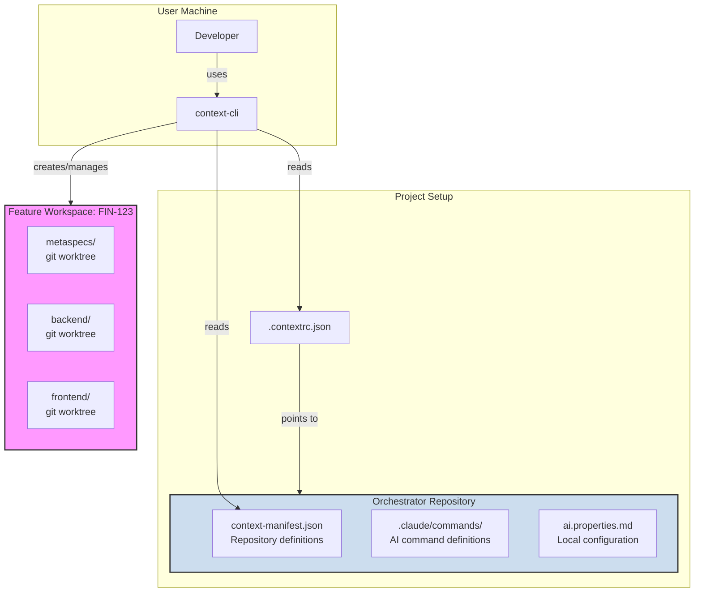

# Context-First CLI

A generic, cross-platform CLI to manage the **Context-First** development methodology across any project ecosystem. This tool provides a robust framework for orchestrating development workflows, managing multiple repositories, and ensuring consistency for both human developers and AI agents.

---

## 🚀 Core Concepts

This CLI is built on three core concepts that enable scalable, parallel, and context-aware development.

### 1. The Orchestrator Repository

Instead of embedding process logic into each of your application repositories, you define it in one central **Orchestrator Repository**. This repository acts as the single source of truth for your development methodology. It contains:

-   **Command Definitions**: Markdown files (`.claude/commands/`) that instruct an AI (like Claude) on the purpose and logic of each step in your process (e.g., `/work`, `/spec`, `/pr`).
-   **Repository Manifest**: A `context-manifest.json` file that maps out your entire project ecosystem, defining all repositories (including MetaSpecs) and their relationships.
-   **Configuration Templates**: Files like `ai.properties.md` that define project-specific commands (lint, test, build) and settings.

### 2. Feature Workspaces

To enable parallel development without conflicts, the CLI uses **Feature Workspaces**. When you start working on a new feature (e.g., an issue from Jira), the CLI creates a dedicated, isolated directory. Inside this workspace, it uses `git worktree` to check out a specific branch for each relevant repository. This is extremely efficient, as it doesn't re-clone the entire repository, saving disk space and time.

-   **Isolation**: Every feature has its own folder, preventing any overlap or context-clash between concurrent tasks.
-   **Efficiency**: Powered by `git worktree`, creating and switching between workspaces is nearly instantaneous.

### 3. The Agnostic CLI (`context-cli`)

This is the tool you install on your machine. It's completely project-agnostic. You can use the same CLI to manage any project.

-   **Cross-Platform**: Built with Node.js/TypeScript, it works seamlessly on Windows, macOS, and Linux.
-   **Configurable**: The `init` command creates a `.contextrc.json` file in your project, telling the CLI which Orchestrator to use.
-   **AI-Agnostic**: You can configure it to create command structures for different AI providers (e.g., `.claude/commands` for Claude, `.cursor/commands` for Cursor).

---

## 📦 Installation

Install the CLI globally on your machine via NPM.

```bash
npm install -g context-first-cli
```

---

## 📋 Commands Reference

### Setup Commands

| Command | Description |
| :--- | :--- |
| `context-cli init` | Initialize Context-First in an existing project by creating `.contextrc.json`. |
| `context-cli create:orchestrator` | Create a new orchestrator repository from a template with all necessary structure. |
| `context-cli add:repo` | Add a new code repository to `context-manifest.json` interactively. |
| `context-cli add:repo-metaspec` | Add or update the MetaSpecs repository in `context-manifest.json`. |
| `context-cli config:setup` | Interactively configure `ai.properties.md` for local development. |

### Workspace Commands

| Command | Description |
| :--- | :--- |
| `context-cli feature:start <issue-id>` | Create a new feature workspace with isolated git worktrees. |
| `context-cli feature:list` | List all active feature workspaces on your machine. |
| `context-cli feature:switch <issue-id>` | Get the command to switch to an existing feature workspace. |
| `context-cli feature:end <issue-id>` | Archive and clean up a completed feature workspace. |

### Diagnostic Commands

| Command | Description |
| :--- | :--- |
| `context-cli doctor` | Check environment and configuration for issues. |
| `context-cli status` | Show detailed status of the current workspace. |

---

## 🚀 Getting Started: Complete Workflow

### Step 1: Create a New Orchestrator

First, create a central orchestrator for your project ecosystem.

```bash
npx context-first-cli@latest create:orchestrator
```

This will guide you through an interactive setup:
1.  **Project name** (e.g., `my-project-orchestrator`)
2.  **Project description**
3.  **MetaSpecs repository URL** (Git URL of your specifications repository)
4.  **Task manager** (Jira, Linear, GitHub, or None)
5.  **Initialize Git** (optional: create initial commit)

The orchestrator will be created with:
- `.claude/commands/` - 11 command definitions for AI (warm-up, products, engineer, quality)
- `context-manifest.json` - Repository manifest with your MetaSpecs already configured
- `ai.properties.md` - Configuration template (gitignored, each dev has their own)
- `.sessions/` - Session data directory (gitignored)

### Step 2: Add Application Repositories

Navigate into your orchestrator directory and add your application repositories.

```bash
cd my-project-orchestrator/

# Add your backend repository
npx context-first-cli@latest add:repo
# You'll be asked for: ID, URL, description, role, dependencies

# Add your frontend repository
npx context-first-cli@latest add:repo

# Add more repositories as needed
npx context-first-cli@latest add:repo
```

Each repository will be added to `context-manifest.json` with its configuration.

### Step 3: Configure Local Environment

Run `config:setup` to interactively configure your local `ai.properties.md` file.

```bash
cd my-project-orchestrator/
npx context-first-cli@latest config:setup
```

This will ask for:
1.  **Base workspace path** (where repositories will be cloned, e.g., `~/workspace`)
2.  **Auto-clone** (whether to clone missing repositories automatically)
3.  **Task manager** settings (Jira, Linear, etc.)

This generates an `ai.properties.md` file tailored to your machine, following the convention-over-configuration principle.

**Note**: This file is gitignored because it contains local paths specific to each developer.

### Step 4: Initialize Your Application Repositories

For each of your application repositories, run `init` to link it to the orchestrator.

```bash
cd /path/to/your/backend/
npx context-first-cli@latest init
```

This will ask for:
1.  The Git URL of your orchestrator repository
2.  Your AI provider (Claude, Cursor, etc.)

A `.contextrc.json` file will be created linking this project to the orchestrator.

### Step 5: Start Working on a Feature

Now you can start working on a feature from any of your configured repositories.

```bash
cd /path/to/your/backend/
npx context-first-cli@latest feature:start FIN-123
```

This will:
1.  Create a new workspace directory (e.g., `~/workspaces/FIN-123/`)
2.  Use `git worktree` to check out branches for all required repositories
3.  Set up the workspace with proper structure

### Step 6: Manage Your Workspaces

```bash
# List all active workspaces
npx context-first-cli@latest feature:list

# Get the command to switch to a workspace
npx context-first-cli@latest feature:switch FIN-123
# Then run the displayed command: cd ~/workspaces/FIN-123

# Check the status of your current workspace
cd ~/workspaces/FIN-123/
npx context-first-cli@latest status

# Clean up a finished workspace
npx context-first-cli@latest feature:end FIN-123
```

---

## 🏗️ Architecture Overview



This structure ensures a clean separation of concerns:

-   **The CLI** is the universal engine that works for any project
-   **The Orchestrator** defines the process and ecosystem for a specific project
-   **The Workspace** is the temporary, isolated environment where work happens

---

## 📝 Example: Complete Setup for a New Project

```bash
# 1. Create orchestrator
npx context-first-cli@latest create:orchestrator
# Name: my-saas-orchestrator
# MetaSpecs URL: git@github.com:myorg/my-saas-metaspecs.git

# 2. Add repositories
cd my-saas-orchestrator/
npx context-first-cli@latest add:repo
# ID: backend, URL: git@github.com:myorg/my-saas-backend.git

npx context-first-cli@latest add:repo
# ID: frontend, URL: git@github.com:myorg/my-saas-frontend.git

npx context-first-cli@latest add:repo
# ID: admin, URL: git@github.com:myorg/my-saas-admin.git

# 3. Configure local environment
npx context-first-cli@latest config:setup
# Base path: ~/workspace
# Auto-clone: Yes
# Task manager: Jira

# 4. Push orchestrator to Git
git remote add origin git@github.com:myorg/my-saas-orchestrator.git
git push -u origin main

# 5. Initialize each application repo
cd ~/projects/my-saas-backend/
npx context-first-cli@latest init
# Orchestrator URL: git@github.com:myorg/my-saas-orchestrator.git
# AI Provider: claude

# 6. Start working on a feature
npx context-first-cli@latest feature:start PROJ-123
cd ~/workspaces/PROJ-123/
# All repositories are now checked out and ready to work!
```

---

## 📝 License

MIT

---

## 🔗 Links

- **NPM Package**: https://www.npmjs.com/package/context-first-cli
- **GitHub Repository**: https://github.com/thatix-io/context-first-cli
- **Issues & Support**: https://github.com/thatix-io/context-first-cli/issues
